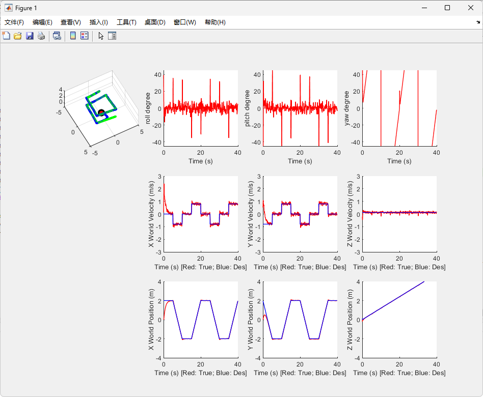

# **proj1phase1-徐涵-202293010207**

# 结果演示

matlab的fig以及截图保存在assets目录中。

## circle trajectory


均方根误差：

```matlab
Start Simulation ...

ans =

    0.5097
    0.0545
    0.0465
    0.4821
    0.1204
    0.1337
    1.0371
    0.0626
    0.0660
    1.0097
    3.1034
    3.1145
    1.2748
```

## diamond trajectory


均方根误差：

```matlab
Start Simulation ...

ans =

    0.0146
    0.0219
    0.0136
    0.0597
    0.0962
    0.0592
    0.9981
    0.0391
    0.0400
    0.9850
    0.9849
    1.2824
    0.7232
```

## hover trajectory


均方根误差：

```matlab
Start Simulation ...

ans =

    0.0155
    0.0156
    0.0075
    0.0545
    0.0610
    0.0411
    0.0013
    0.0305
    0.0266
    0.0051
    0.8870
    0.7929
    0.3196
```

# 参数以及代码解释

代码使用向量化操作。

## PD控制参数

```matlab
kp_xyz = [10.5; 10.5; 30.5];    % Position gain
kd_xyz = [10.5; 10.5; 15.5];    % Velocity gain
kp_angle = [900; 900; 900];  % Attitude gain
kd_angle = [50; 50; 50];  % Angular velocity gain
```

## 数据读取

```matlab
x = s(1:3);       % 当前位置
d_x = s(4:6);       % 当前速度
quat = s(7:10);     % 当前四元数
d_angle = s(11:13); % 当前角速度

x_c = s_des(1:3);   % 期望位置
d_x_c = s_des(4:6);   % 期望速度
quat_c = s_des(7:10); % 期望四元数
d_angle_c = s_des(11:13); % 期望角速度
```

## 计算输出

```matlab
x_error = x_c - x;
d_x_error = d_x_c - d_x;
dd_x_c = [0;0;0];
dd_x = dd_x_c + kp_xyz .* x_error + kd_xyz .* d_x_error;
F = m * (dd_x(3) + g);

% ---------------- 姿态控制 ----------------
[phi_c,theta_c,psi_c] = RotToRPY_ZXY(QuatToRot(quat_c));
[phi,theta,psi] = RotToRPY_ZXY(QuatToRot(quat));
% refactor phi_c and theta_c
phi_c = 1/g * (dd_x(1) * sin(psi) - dd_x(2) * cos(psi));
theta_c = 1/g * (dd_x(1) * cos(psi) + dd_x(2) * sin(psi));
phi_error = phi_c-phi;
theta_error = theta_c-theta;


psi_error = psi_c-psi;
psi_error = mod(psi_error, 2*pi);
if(psi_error<=-pi)
    psi_error=psi_error + 2 * pi;
elseif(psi_error>=pi)
    psi_error=psi_error - 2 * pi;
end

angle_error = [phi_error;theta_error;psi_error];
d_angle_error = d_angle_c - d_angle;

Rotation = QuatToRot(quat);
dd_angle = kp_angle .* angle_error + kd_angle .* (d_angle_error);
M = I * dd_angle +  cross(Rotation * d_angle, (I * Rotation * d_angle));
```

# 自定义路线演示



均方根误差：

```matlab
Start Simulation ...

ans =

    0.2385
    0.2268
    0.0153
    0.2711
    0.2612
    0.0626
    1.0360
    0.0592
    0.0627
    1.0089
    1.7972
    1.8890
    0.8234
```


